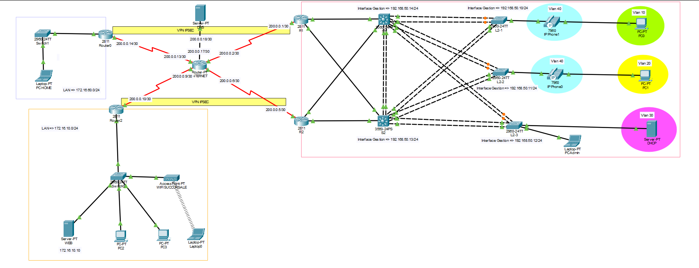
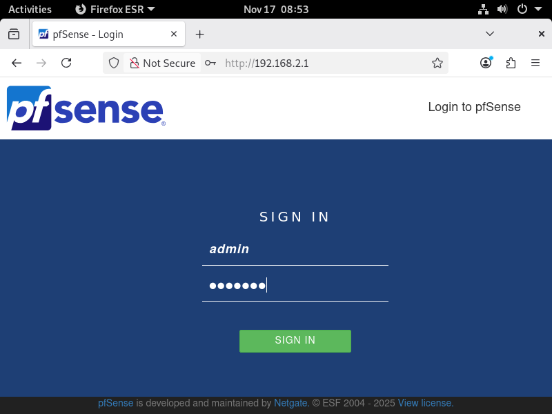
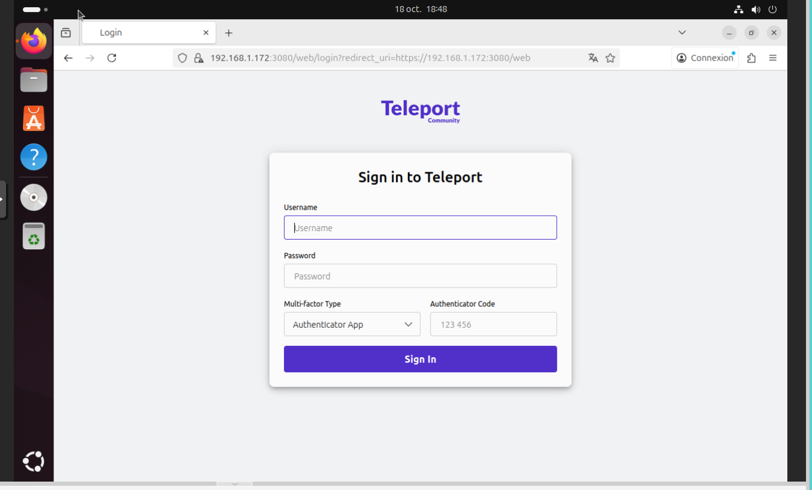
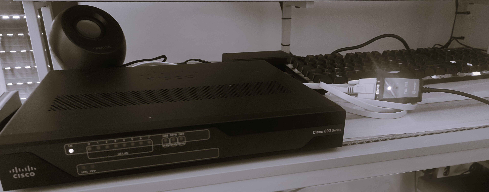

# Portfolio Jimmy PAULIN - Administrateur d’Infrastructures Sécurisées
---

En reconversion vers l’**administration d’infrastructures sécurisées**, je conçois et implémente des labs complets mêlant réseaux Cisco, virtualisation, firewall pfSense, VPN, bastions et homelab sur matériel réel.  
Ce portfolio regroupe une sélection de TP et projets réalisés en formation AIS (Simplon, Formatik) et en labs personnels.

- Localisation : Sorbiers (42) – proche Saint-Étienne  
- Formation : AIS – Administrateur d’Infrastructures Sécurisées  
- Centres d’intérêt : réseaux Cisco, pfSense, VPN, bastions, virtualisation (Proxmox), cyber, scripts Python  

[GitHub](https://github.com/JiJiJuve) · [LinkedIn](https://www.linkedin.com/in/jimmy-paulin) · Contact : [jimmy.paulin@outlook.fr](mailto:jimmy.paulin@outlook.fr)

---

## 1. Gros projets réseau & sécurité (Cisco)

### Infrastructure réseau multi‑sites haute disponibilité (Cisco Packet Tracer)

Dans ce lab, je conçois une infrastructure complète avec un siège, une succursale et un site « Home ».  
J’y mets en place : VLAN, VTP, trunks, EtherChannel, STP, routage inter‑VLAN sur switch L3, HSRP, DHCP centralisé avec ip helper‑address, téléphonie IP (CME + TFTP), OSPF interne, NAT/PAT, serveur web publié, VPN IPsec site‑à‑site (Phase 1/2 + NONAT), VLAN de gestion et accès SSH, ainsi qu’un Wi‑Fi sur la succursale.  
Le TP est entièrement documenté et versionné ici : [TP détaillé](https://github.com/JiJiJuve/TP-Perso/tree/master/TP-Perso/TP-Infra-Haute-Dispo).

---

## 2. Virtualisation & pfSense

### Installation Proxmox VE + pfSense en lab virtualisé

Dans ce projet, je déploie Proxmox dans VirtualBox, avec vérification de l’empreinte SHA256 de l’ISO pour garantir l’intégrité.  
Je configure le réseau (bridge vmbr1), crée une VM pfSense, paramètre les interfaces WAN/LAN, le DHCP, et j’accède à l’interface web depuis une VM Debian cliente.  
Ce lab pose les bases d’un environnement pour futurs labs réseau/sécurité : [TP détaillé](https://github.com/JiJiJuve/TP-Perso/tree/master/TP-Perso/Proxmox%2BPfsense).

### VPN Client-to-Site avec pfSense & OpenVPN

Je mets en place un pare‑feu pfSense jouant le rôle de serveur VPN pour du télétravail sécurisé.  
Je crée un serveur OpenVPN SSL/TLS (CA, certificats serveur/client), ajoute les règles firewall nécessaires (DNS, HTTP/HTTPS, ICMP, OpenVPN), exporte et installe les profils sur une VM externe, puis je teste l’accès au LAN depuis l’extérieur.  
Les étapes sont détaillées ici : [TP détaillé](https://github.com/JiJiJuve/TP-Perso/tree/master/TP-Perso/Pfsense%2BOpenVPN).

---

## 3. Bastions d’administration & accès sécurisé

### Bastion d’administration Zero Trust avec Teleport

Je réalise une étude comparative entre Teleport et Apache Guacamole (sécurité, audit, types d’accès, déploiement), puis je déploie un bastion Teleport sur Debian.  
Je mets en place un modèle Zero Trust avec certificats éphémères et MFA, j’enrôle des serveurs comme ressources dans le bastion et j’effectue des connexions SSH depuis une VM cliente, avec traçabilité avancée des sessions.  
Le compte-rendu du lab est disponible ici : [TP Teleport](https://github.com/JiJiJuve/Simplon_Formation_AIS/blob/main/Bastion.md).

### Bastion d’administration web avec Apache Guacamole

Dans ce lab, je déploie Apache Guacamole sur Debian (stack Tomcat + base SQL) pour offrir un accès RDP/SSH via un simple navigateur web.  
Je configure les utilisateurs et les connexions, je publie une VM Windows Server 2022 comme ressource administrable et je teste l’administration distante via le bastion depuis une VM cliente.  
Le TP complet est disponible ici : [TP Guacamole](https://github.com/JiJiJuve/Simplon_Formation_AIS/blob/main/Guacamole.md).

---

## 4. Lab réel sur matériel Cisco

### Mise à jour IOS sur switch Cisco C2960X-24PS-L

Je récupère et mets à jour l’IOS d’un switch Cisco C2960X-24PS-L via un serveur TFTP.  
Je me connecte en console (PuTTY), installe et configure le serveur TFTP, configure une IP de management, teste la connectivité (ping PC / switch / serveur TFTP), transfère la nouvelle image, configure le boot, vérifie la version active, supprime l’ancienne image et sauvegarde la configuration.  
Une description détaillée est disponible dans ce post : [mise à jour du switch](https://www.linkedin.com/posts/jimmy-paulin_cisco-switching-raezseau-activity-7348729828654698498-KFgT).

### Récupération d’accès et config de base d’un routeur Cisco C892FSP-K9

Sur un routeur Cisco C892FSP-K9, je passe en mode ROMMON pour récupérer l’accès administrateur (manipulation du registre de configuration 0x2142 / 0x2102).  
Je boote sans la configuration, récupère la startup-config, modifie les mots de passe, puis je mets en place une configuration de base : hostname, mots de passe console/VTY/enable secret, chiffrement des mots de passe et vérifications (show version, show interfaces, etc.).  
Je documente ce travail dans plusieurs posts : [ROMMON + config de base + lab réel routeur](https://www.linkedin.com/posts/jimmy-paulin_cisco-networkengineer-itlab-activity-7345837899201835008-Ttxm).

---

## 5. Réseau maison & projets en cours

Je construis progressivement un **réseau domestique avancé** dans ma nouvelle maison, en m’appuyant sur du matériel réel et des solutions open source.

Je prévois une baie de brassage avec routeur et switch Cisco, Wi‑Fi et segmentation par VLAN (utilisateurs, IoT/domotique, invités, management), complétée par des règles de sécurité (ACL).  
Je travaille aussi sur un **firewall dédié pfSense** : récupération de plusieurs vieux PC pour en faire une machine optimisée (mini‑serveur) qui prendra à terme le relais de la box FAI pour le NAT, le firewall et les VPN.  
Un **serveur Proxmox** hébergera les VM (services internes, lab cyber), un futur NAS et d’autres briques d’infrastructure (surveillance, supervision, etc.).  

Ces projets viendront prolonger les labs déjà réalisés en virtualisé (Proxmox + pfSense, VPN OpenVPN) par une mise en pratique sur matériel réel, dans un environnement proche d’une petite entreprise.

---

## 6. Services d’infrastructure (annuaire, support, supervision)

### Annuaire Active Directory & services de domaine (AD DS)

Mise en place d’un domaine Active Directory pour centraliser l’authentification et la gestion des comptes utilisateurs/ordinateurs.  
Configuration du contrôleur de domaine, des unités d’organisation (OU), des stratégies de groupe (GPO) de base et des services associés (DNS intégré à AD, gestion des groupes et droits).  
TP en cours de rédaction et bientôt disponible dans le repo : section dédiée au domaine **AD DS**.

### Gestion de parc et support avec GLPI

Déploiement de GLPI sur Debian (serveur web + base de données) pour gérer le parc informatique et les demandes des utilisateurs.  
Mise en place de la gestion des tickets d’incident, de l’inventaire du matériel, des catégories et des profils pour simuler un service support dans une petite structure.  
La documentation complète sera intégrée dans le TP combiné d’infrastructure : **GLPI + AD DS + Zabbix + pfSense**.

### Supervision avec Zabbix 7 sur Debian 13

Installation de Zabbix 7 sur Debian 13 avec MariaDB, Apache et interface web pour surveiller serveurs et services.  
Ajout d’agents de supervision sur les machines, création de premiers hôtes supervisés, utilisation de templates et de règles d’alerte pour suivre la disponibilité et les ressources.  
La fiche détaillée d’installation et de configuration Zabbix 7 sera référencée ici dès qu’elle sera publiée dans le repo TP-Perso.

---

## 7. À venir

- Ajout de **scripts Python d’automatisation** (tri/renommage de fichiers, maintenance système, petits outils pour l’admin réseau).  
- Intégration d’un **gros lab d’infrastructure complet** combinant **AD DS, GLPI, Zabbix et pfSense** dans un même scénario (domaine Windows, support utilisateurs avec gestion des tickets, supervision centralisée, accès distant sécurisé), avec schémas, procédures et bonnes pratiques.  
- Mise en avant de **labs de cybersécurité et de cryptographie appliquée** : chiffrement symétrique de fichiers avec OpenSSL (AES‑256‑CBC + PBKDF2) sur Kali, et scripts Python de chiffrement/déchiffrement de fichiers en AES‑GCM avec dérivation de clé via scrypt et gestion correcte du salt, nonce et tag d’intégrité.  

Ce portfolio vise à montrer ma capacité à :
- concevoir une architecture réseau/sécurité cohérente,  
- documenter clairement mes labs,  
- et faire le lien entre formations AIS, labs personnels et homelab sur matériel réel.

