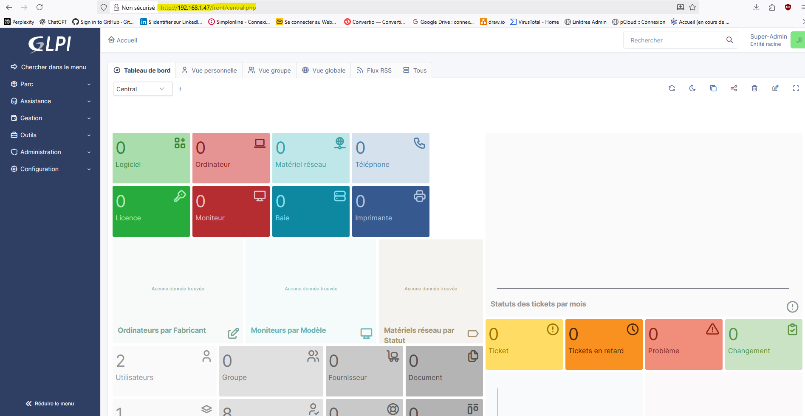

```markdown
# Portfolio Jimmy PAULIN - Administrateur d’Infrastructures Sécurisées

En reconversion vers l’**administration d’infrastructures sécurisées**, je conçois et implémente des labs complets mêlant réseaux Cisco, virtualisation, firewall pfSense, VPN, bastions, cryptographie et homelab sur matériel réel.  
Ce portfolio regroupe une sélection de TP et projets réalisés en formation AIS (Simplon, Formatik) et en labs personnels.

- Localisation : Sorbiers (42) – proche Saint-Étienne  
- Formation : AIS – Administrateur d’Infrastructures Sécurisées  
- Centres d’intérêt : réseaux Cisco, pfSense, VPN, bastions, virtualisation (Proxmox), cyber, scripts Python, cryptographie appliquée  

[GitHub](https://github.com/JiJiJuve) · [LinkedIn](https://www.linkedin.com/in/jimmy-paulin) · Contact : [jimmy.paulin@outlook.fr](mailto:jimmy.paulin@outlook.fr)

---

## 1. Gros projets réseau & sécurité (Cisco)


### Infrastructure réseau multi‑sites haute disponibilité (Cisco Packet Tracer)

Conception d’une infrastructure complète avec un siège, une succursale et un site « Home ».  
Mise en place de VLAN, VTP, trunks, EtherChannel, STP, routage inter‑VLAN sur switch L3, HSRP, DHCP centralisé avec ip helper‑address, téléphonie IP (CME + TFTP), OSPF interne, NAT/PAT, serveur web publié, VPN IPsec site‑à‑site (IKE Phase 1 : canal sécurisé, négociation et IKE Phase 2 : création des SA pour le trafic utilisateur), VLAN de gestion et accès SSH, ainsi qu’un Wi‑Fi sur la succursale.  
TP entièrement documenté et versionné ici : [TP détaillé](https://github.com/JiJiJuve/TP-Perso/tree/master/TP-Perso/TP-Infra-Haute-Dispo).

---

## 2. Virtualisation & pfSense


### Installation Proxmox VE + pfSense en lab virtualisé

Déploiement de Proxmox dans VirtualBox, avec vérification de l’empreinte SHA256 de l’ISO pour garantir l’intégrité.  
Configuration du réseau (bridge vmbr1), création d’une VM pfSense, paramétrage des interfaces WAN/LAN, du DHCP, et accès à l’interface web depuis une VM Debian cliente.  
Lab servant de base à de futurs labs réseau/sécurité : [TP détaillé](https://github.com/JiJiJuve/TP-Perso/tree/master/TP-Perso/Proxmox%2BPfsense).

### VPN Client-to-Site avec pfSense & OpenVPN

Mise en place d’un pare‑feu pfSense jouant le rôle de serveur VPN pour du télétravail sécurisé.  
Création d’un serveur OpenVPN SSL/TLS (CA, certificats serveur/client), ajout des règles firewall nécessaires (DNS, HTTP/HTTPS, ICMP, OpenVPN), export et installation des profils sur une VM externe, tests d’accès au LAN depuis l’extérieur.  
Étapes détaillées ici : [TP détaillé](https://github.com/JiJiJuve/TP-Perso/tree/master/TP-Perso/Pfsense%2BOpenVPN).

---

## 3. Bastions d’administration & accès sécurisé


### Bastion d’administration Zero Trust avec Teleport

Étude comparative entre Teleport et Apache Guacamole (sécurité, audit, types d’accès, déploiement), puis déploiement d’un bastion Teleport sur Debian.  
Mise en place d’un modèle Zero Trust avec certificats éphémères et MFA, enrôlement de serveurs comme ressources dans le bastion et connexions SSH depuis une VM cliente, avec traçabilité avancée des sessions.  
Compte-rendu disponible ici : [TP Teleport](https://github.com/JiJiJuve/Simplon_Formation_AIS/blob/main/Bastion.md).

### Bastion d’administration web avec Apache Guacamole

Déploiement d’Apache Guacamole sur Debian (stack Tomcat + base SQL) pour offrir un accès RDP/SSH via navigateur web.  
Configuration des utilisateurs et des connexions, publication d’une VM Windows Server 2022 comme ressource administrable et tests d’administration distante via le bastion depuis une VM cliente.  
TP complet : [TP Guacamole](https://github.com/JiJiJuve/Simplon_Formation_AIS/blob/main/Guacamole.md).

---

## 4. Lab réel sur matériel Cisco


### Mise à jour IOS sur switch Cisco C2960X-24PS-L

Récupération et mise à jour de l’IOS d’un switch Cisco C2960X-24PS-L via un serveur TFTP.  
Connexion en console (PuTTY), installation et configuration du serveur TFTP, configuration d’une IP de management, tests de connectivité (ping PC / switch / serveur TFTP), transfert de la nouvelle image, configuration du boot, vérification de la version active, suppression de l’ancienne image et sauvegarde de la configuration.  
Description détaillée : [mise à jour du switch](https://www.linkedin.com/posts/jimmy-paulin_cisco-switching-raezseau-activity-7348729828654698498-KFgT).

### Récupération d’accès et config de base d’un routeur Cisco C892FSP-K9

Sur un routeur Cisco C892FSP-K9, passage en mode ROMMON pour récupérer l’accès administrateur (manipulation du registre de configuration 0x2142 / 0x2102).  
Boot sans la configuration, récupération de la startup-config, modification des mots de passe, puis mise en place d’une configuration de base : hostname, mots de passe console/VTY/enable secret, chiffrement des mots de passe et vérifications (show version, show interfaces, etc.).  
Travail documenté dans plusieurs posts : [ROMMON + config de base + lab réel routeur](https://www.linkedin.com/posts/jimmy-paulin_cisco-networkengineer-itlab-activity-7345837899201835008-Ttxm).

---

## 5. Cryptographie appliquée (OpenSSL, Python AES‑GCM, signatures)

### Dossier Cryptographie – Chiffrement & signatures

Mise en place d’un dossier dédié à la cryptographie appliquée dans le repo TP‑Perso.  
Les labs couvrent :

- **Chiffrement symétrique de fichiers et dossiers avec OpenSSL**  
  - Chiffrement/déchiffrement de fichiers en AES‑256‑CBC avec PBKDF2 (`openssl enc -aes-256-cbc -pbkdf2 -iter 100000 -salt`).  
  - Chiffrement de dossiers via compression ZIP/TAR puis chiffrement OpenSSL.  
  - Génération de clés RSA (`private.pem` / `public.pem`) et chiffrement hybride : clé AES aléatoire pour le fichier, elle-même chiffrée en RSA pour l’échange sécurisé.

- **Chiffrement authentifié de fichiers en AES‑GCM avec Python (PyCryptodome + scrypt)**  
  - Script `chiffrer-gcm.py` : dérivation d’une clé AES‑256 à partir d’un mot de passe avec `scrypt` (`N=2**14, r=8, p=1`), chiffrement d’un fichier en AES‑GCM et écriture d’un fichier chiffré structuré `[salt][nonce][tag][ciphertext]`.  
  - Script `dechiffrer-gcm.py` : lecture du fichier chiffré, redérivation de la clé, `decrypt_and_verify` pour garantir l’intégrité et le bon mot de passe, recréation du fichier en clair.  

- **Signature de scripts PowerShell avec certificat auto-signé**  
  - Création d’un certificat de code signing (`New-SelfSignedCertificate -Type CodeSigningCert`), export en `.cer` et import dans les magasins `Root` et `TrustedPublisher`.  
  - Signature des scripts avec `Set-AuthenticodeSignature`, vérification via `Get-AuthenticodeSignature` et configuration de la politique d’exécution (`RemoteSigned`, `AllSigned`).

Les fiches détaillées sont regroupées ici :  
→ [Dossier Cryptographie sur GitHub](https://github.com/JiJiJuve/TP-Perso/tree/master/TP-Perso/Cryptographie)

---

## 6. Réseau maison & projets en cours

Construction progressive d’un **réseau domestique avancé** dans une nouvelle maison, en s’appuyant sur du matériel réel et des solutions open source.

Mise en place prévue d’une baie de brassage avec routeur et switch Cisco, Wi‑Fi et segmentation par VLAN (utilisateurs, IoT/domotique, invités, management), complétée par des règles de sécurité (ACL).  
Travail en cours sur un **firewall dédié pfSense** : récupération de plusieurs PC pour en faire une machine optimisée (mini‑serveur) qui prendra à terme le relais de la box FAI pour le NAT, le firewall et les VPN.  
Un **serveur Proxmox** hébergera les VM (services internes, lab cyber), un futur NAS et d’autres briques d’infrastructure (surveillance, supervision, etc.).  

Ces projets prolongent les labs déjà réalisés en virtualisé (Proxmox + pfSense, VPN OpenVPN) par une mise en pratique sur matériel réel, dans un environnement proche d’une petite entreprise.

---

## 7. Services d’infrastructure (annuaire, support, supervision)

### Annuaire Active Directory & services de domaine (AD DS)


Mise en place d’un domaine Active Directory pour centraliser l’authentification et la gestion des comptes utilisateurs/ordinateurs.  
Configuration du contrôleur de domaine, des unités d’organisation (OU), des stratégies de groupe (GPO) de base et des services associés (DNS intégré à AD, gestion des groupes et droits).  
TP complet : [TP AD DS Windows Server 2025](https://github.com/JiJiJuve/TP-Perso/tree/master/TP-Perso/AD-DS-Windows-Server-2025).

### Gestion de parc et support avec GLPI



Déploiement de GLPI sur Debian (serveur web + base de données) pour gérer le parc informatique et les demandes des utilisateurs.  
Mise en place de la gestion des tickets d’incident, de l’inventaire du matériel, des catégories et des profils pour simuler un service support dans une petite structure.  
TP complet : [TP GLPI](https://github.com/JiJiJuve/TP-Perso/tree/master/TP-Perso/GLPI).

### Supervision avec Zabbix 7 sur Debian 13


Installation de Zabbix 7 sur Debian 13 avec MariaDB, Apache et interface web pour surveiller serveurs et services.  
Ajout d’agents de supervision sur les machines, création de premiers hôtes supervisés, utilisation de templates et de règles d’alerte pour suivre la disponibilité et les ressources.  
TP détaillé : [TP Zabbix 7 sur Debian 13](https://github.com/JiJiJuve/TP-Perso/tree/master/TP-Perso/Zabbix).

---

## 8. Scripts Python et labs à venir

- Ajout de **scripts Python d’automatisation** (tri/renommage de fichiers, maintenance système, petits outils pour l’admin réseau), avec une documentation claire des usages (argparse, dry-run, nettoyage, etc.).  
  → [Voir les scripts Python sur GitHub](https://github.com/JiJiJuve/TP-Perso/tree/master/TP-Perso/Python-Scripts)

- Intégration d’un **gros lab d’infrastructure complet** combinant **AD DS, GLPI, Zabbix, pfSense et cryptographie** dans un même scénario (domaine Windows, support utilisateurs, supervision centralisée, accès distant sécurisé, protection des données).

Ce portfolio montre la capacité à :
- concevoir des architectures réseau/sécurité cohérentes,  
- mettre en œuvre des solutions concrètes (Cisco, pfSense, Proxmox, bastions, crypto),  
- documenter clairement les labs et faire le lien entre formation AIS, labs personnels et homelab sur matériel réel.
```
